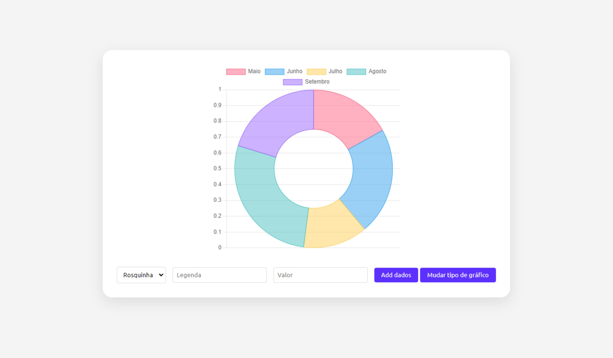
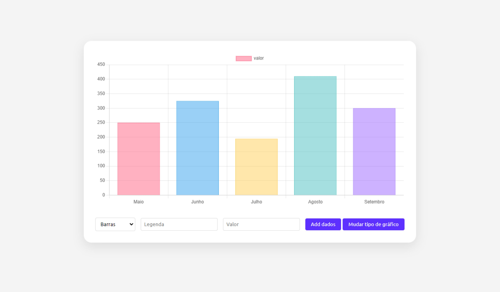

# Gerador de Gráficos

## Sobre o projeto

Um app simples capaz de gerar gráficos de varios tipos como linhas, colunas e pizza.

## Como utilizar

Basta inserir a legenda e o valor correpondente e clicar no botão "Add dados", para gerar um gráfico. Também é possível modificar o tipo de gráfico a ser apresentado.

## Informações

Projeto desenvolvido utilizando apenas HTML, CSS e JavaScript.

